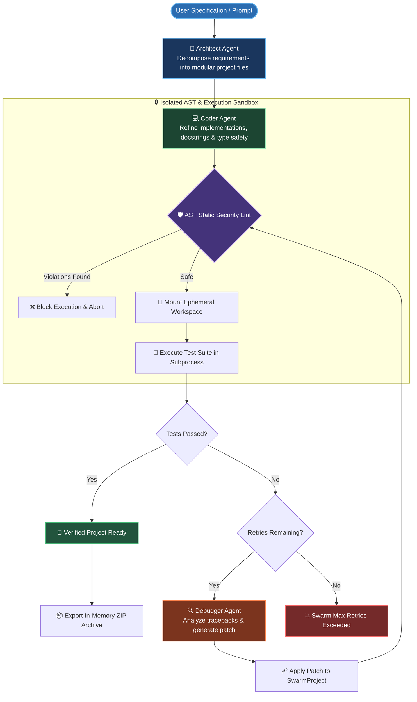

<div align="center">

# 🤖 AutoHeal Swarm
### *Autonomous Multi-Agent Software Development & Self-Healing Swarm*

[](https://groq.com)
[](https://streamlit.io)
[](https://docs.pydantic.dev/)
[](https://www.python.org/)
[](LICENSE)

<p align="center">
  <a href="#-architecture--workflow">Architecture</a> •
  <a href="#-key-features">Key Features</a> •
  <a href="#-quick-start">Quick Start</a> •
  <a href="#-multi-agent-roster">Agent Roster</a> •
  <a href="#-security-sandbox">Security Sandbox</a> •
  <a href="#-license">License</a>
</p>

</div>

---

## 🌟 Overview

**AutoHeal Swarm** is an autonomous software engineering system that turns natural language specifications into verified, production-grade Python projects. 

Powered by high-throughput **Groq LPUs**, AutoHeal Swarm orchestrates a team of specialized AI agents working inside an **AST-governed execution sandbox**. The swarm decomposes requirements, generates modular code, synthesizes comprehensive unit tests, executes test suites in isolated subprocesses, and **autonomously debugs and self-heals failing code** in a real-time feedback loop.

---

## 🔄 Architecture & Workflow



---

## ✨ Key Features

- **🧠 Specialized Multi-Agent Pipeline**:
  - **Architect Agent**: Breaks down specifications into modular architecture files (`source`, `test`, `config`).
  - **Coder Agent**: Adds defensive error handling, docstrings, type annotations, and edge-case guards.
  - **Debugger Agent**: Ingests compiler tracebacks, `stdout`, and `stderr` to perform root-cause analysis and generate atomic patches.
- **🛡️ AST Static Security Engine**:
  - Zero-trust static AST analysis (`ast.NodeVisitor`) scanning generated code **prior to disk writes**.
  - Restricts dynamic evaluation (`eval`, `exec`, `__import__`), OS manipulation (`os.system`, `subprocess.*`), network sockets (`socket.*`, `http.server`), and foreign function wrappers (`ctypes`, `cffi`).
- **⚡ Ephemeral Subprocess Sandbox**:
  - Executes unit tests in isolated, time-bounded subprocesses with dedicated `PYTHONPATH` isolation.
  - Guarantees deterministic filesystem cleanup on test completion or timeout.
- **🔄 Fault-Tolerant Model Fallback Cascading**:
  - Automatic model fallback across `openai/gpt-oss-120b`, `openai/gpt-oss-20b`, `qwen/qwen3.6-27b`, and `groq/compound-mini`.
  - Built-in JSON bracket-stack repair and `failed_generation` recovery for truncated LLM responses.
- **🖥️ Real-Time Streamlit Command Center**:
  - Dual-column telemetry dashboard with live agent status stream and tabbed source code viewer.
  - Instant one-click project download as `.zip`.
- **📐 Strict Pydantic v2 Contracts**:
  - Strictly validated data models (`FileArtifact`, `DebuggingPatch`, `SwarmProject`) with automated markdown code-fence sanitization.

---

## 🤖 Multi-Agent Roster

| Agent | Icon | Responsibilities | Default Model |
| :--- | :---: | :--- | :--- |
| **Architect** | 🧠 | System decomposition, modular file hierarchy, dependency planning | `openai/gpt-oss-120b` |
| **Coder** | 💻 | Production-grade code synthesis, type hinting, unit tests | `openai/gpt-oss-120b` |
| **Sandbox** | 🔒 | AST static policy linting, ephemeral workspace execution, timeout monitoring | *Native Python AST Engine* |
| **Debugger** | 🔍 | Traceback inspection, root-cause diagnosis, self-healing patch synthesis | `openai/gpt-oss-120b` |

---

## 📂 Project Structure

```
├── agents.py           # Multi-agent orchestrators & LLM fallback cascade
├── app.py              # Streamlit command dashboard & live UI
├── contracts.py        # Pydantic v2 schemas & patch application logic
├── sandbox.py          # AST static security linter & isolated subprocess runner
├── test_contracts.py   # Unit test suite for validation schemas & data contracts
├── requirements.txt    # Application dependencies
├── .env.example        # Environment variable template
├── LICENSE             # MIT License
└── README.md           # Documentation
```

---

## 🚀 Quick Start

### 1. Prerequisites
- **Python 3.10+**
- A **[Groq Cloud API Key](https://console.groq.com/)**

### 2. Installation

```bash
# Clone the repository
git clone https://github.com/binarylaiba/AI-Heal-Swarm.git
cd "AI-Heal-Swarm"

# Create a virtual environment
python -m venv .venv

# Activate the virtual environment
# On Windows (PowerShell):
.\.venv\Scripts\Activate.ps1
# On Linux/macOS:
source .venv/bin/activate

# Install dependencies
pip install -r requirements.txt
```

### 3. Configure Environment

Create a `.env` file from `.env.example`:

```bash
cp .env.example .env
```

Set your Groq API key inside `.env`:

```env
GROQ_API_KEY=gsk_your_groq_api_key_here
```

### 4. Launch the Web Dashboard

```bash
streamlit run app.py
```

Navigate to `http://localhost:8501` to access the interactive web interface.

---

## 🧪 Testing

Run the contract validation test suite with `unittest`:

```bash
python -m unittest test_contracts.py -v
```

---

## 🔒 Security Sandbox

<details>
<summary><b>Click to expand AST security policy details</b></summary>

AutoHeal Swarm enforces strict AST inspection before any code is written or executed:

- **Disallowed Built-in Functions**: `eval()`, `exec()`, `compile()`, `__import__()`, `breakpoint()`, `memoryview()`.
- **Disallowed Modules & Imports**: `subprocess`, `socket`, `ctypes`, `pty`, `pexpect`, `paramiko`, `ftplib`, `telnetlib`, `http.server`, `xmlrpc`, `multiprocessing`, `cffi`, `winreg`, `msvcrt`, `posix`.
- **Blocked Attributes**: Destructive file helpers (`os.system`, `os.remove`, `os.unlink`, `shutil.rmtree`, `shutil.move`).
- **Dynamic Bypass Detection**: Flags `getattr(module, 'dangerous_func')` patterns.

</details>

---

## 📄 License

Distributed under the **MIT License**. See [`LICENSE`](LICENSE) for more information.

<div align="center">
  <sub>Built with ❤️ by <a href="https://github.com/binarylaiba">Laiba Mushtaq</a></sub>
</div>
